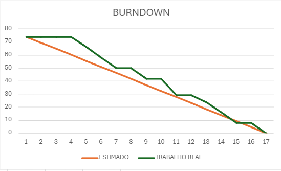

<h1 align="center"> RAMG.O </h1>
<h2 align="center"> FATEC Professor Francisco de Moura, Jacareí - 3º Semestre DSM 2024 </h2>

    <a href="#sobre">Sobre</a> |
    <a href="#tecnologias">Tecnologias</a> |
    <a href="#equipe">Equipe</a> |
    <a href="#entregas">Entregas</a> |
    <a href="#backlog">Backlog</a> |
    <a href="#arquitetura">Arquitetura</a> |

<h1 align="center">Sobre</h1>

Esse projeto foi desenvolvido pelos alunos do 3º semestre da Fatec Professor Francisco de Moura, Jacareí com a proposta de empreendedorismo.

Este aplicativo tem como objetivo monitorar a ingestão diária de calorias e nutrientes, oferecendo suporte para o controle da alimentação e a manutenção de uma saúde equilibrada.

<h1 align="center">Tecnologias</h1>

<h1 align="center">Equipe</h1>

| Função | Foto | Nome | GitHub | LinkedIn |
| :-: | :-: | :-: | :-: | :-: |
|Backend Dev||André Flávio de Olivera|| |
|Scrum Master||Jonatas Filipe Carvalho|| |
|Frontend Dev||Mauro do Prado Santos||  |
|Product Owner||Samuel Lucas Vieira de Melo||  |
|Backend Dev||Vitor Cezar de Souza||  |

<h1 align="center">Entregas</h1>
O projeto tem por base a metodologia ágil SCRUM, por isso foi separado em 3 entregas com sprints de 16 dias de duração cada uma.

<!--  

  -->

<h2>Sprint 1</h2>

Focada no desenvolvimento da aplicação web, mais especificamente os CRUDs de usuário, perfil, alimentos e refeições.

<b>Sprint Backlog:<b>

| Sprint | Funcionalidade | Prioridade |
| :--:   | :-----------:  | :--------: |
| **01** |Cadastro de Usuário | Alta |
| **01** | Listagem de Usuário  | Alta |
| **01** | Exclusão de Usuário  | Alta |
| **01** | Alteração de Usuário  | Alta |
| **01** | Login como Usuário | Alta |
| **01** | Cadastro de Perfil | Alta |
| **01** | Listagem de Perfil | Alta |
| **08** | Exclusão de Perfil | Alta |
| **01** | Alteração de Perfil | Alta |
| **01** | Cadastro de Alimentos | Alta |
| **01** | Listagem de Alimento | Alta |
| **01** | Alteração de Alimento | Alta |
| **01** | Exclusão de Alimento | Alta |
| **01** | Cadastro de Refeição | Alta |
| **01** | Listagem de Refeição | Alta |
| **01** | Alteração de Refeição | Alta |
| **01** | Exclusão de Refeição | Alta |

<h2>Vídeo de Demonstração</h2>
[Assista ao vídeo de demonstração aqui](https://www.youtube.com/watch?v=9zNIedji9bk)

<h2>Gráfico de Burndown</h2>

<h2>Tarefas</h2>

O grupo optou pela organização das tarefas fazendo uso de épicos, User Story, tarefas e subtarefas.

Nesta Sprint 1, o foco do grupo foi realizar o CRUD de alimentos, com a User Story relacionado a cadastrar novos alimentos.Foram realizados também o desenvolvimento da 
tela de edição de dados pessoais, para cálculo da Taxa Metabólica Basal.

| Tipo       | Descrição |
| :--:       | :--------:| 
| Épico      | CRUD dos alimentos da tabela nutricional |
| User Story | Cadastro de novos alimentos para registrar os alimentos consumidos |
| Subtarefa  | Normalização de dados dos alimentos no banco de dados MongoDB      |
| Subtarefa  | Criação de Tela para consulta dos alimentos cadastrados            |
| Subtarefa  | Criação de Formulário na tela para adicionar um novo alimento      |
| Subtarefa  | Criação de rotas e funções para o CRUD de alimentos no backend     |

| Tipo       | Descrição |
| :--:       | :--------:| 
| Épico      | CRUD do perfil do usuário  |
| User Story | Cadastro de perfil de usuário contendo dados para cálculo das calorias |
| Subtarefa  | Criação da Tela para adicionar as informações para cálculo de Taxa Metabólica Basal |
| Subtarefa  | Criação da rota no backend para cadastro das informações e o cálculo das calorias |

<h1 align="center">Backlog</h1>

| Sprint | Funcionalidade | User Story | Prioridade |
| :--:   | :-----------:  | :--------: | :--------: |
| **01** |Cadastro de Usuário | US01 | Alta |
| **01** | Listagem de Usuário  | US02 | Alta |
| **01** | Exclusão de Usuário  | US03 | Alta |
| **01** | Alteração de Usuário  | US04 | Alta |
| **01** | Login como Usuário | US05 | Alta |
| **01** | Cadastro de Perfil | US06 | Alta |
| **01** | Listagem de Perfil | US07 | Alta |
| **08** | Exclusão de Perfil | US08 | Alta |
| **01** | Alteração de Perfil | US09 | Alta |
| **01** | Cadastro de Alimentos | US10 | Alta |
| **01** | Listagem de Alimento | US11 | Alta |
| **01** | Alteração de Alimento | US12 | Alta |
| **01** | Exclusão de Alimento | US13 | Alta |
| **01** | Cadastro de Refeição | US14 | Alta |
| **01** | Listagem de Refeição | US15 | Alta |
| **01** | Alteração de Refeição | US16 | Alta |
| **01** | Exclusão de Refeição | US17 | Alta |
| **02** | Dashboard de Consumo Calórico | US18 | Alta |
| **02** | Sincronização de com aplicativo de exercício| US19 | Média |
| **02** | Disparos de Alertas | US20 | Média |
| **02** | Histórico consumo | US21 | Alta |
| **02** | Importação de Dados de Alimentos | US22 | Alta |
| **03** |  Cadastro de Metas | US23 | Média |
| **03** | Listagem de Metas | US24 | Média |
| **03** | Alteração de Metas | US25 | Média|
| **03** | Exclusão de Metas | US26 | Média |
| **03** | Customização de Interface | US23 | Baixa |
| **03** | Relatório Personalizado com Base nas Refeições/Consumo Calórico | US24 | Média |

<b>User Story</b>

| User Story | Descrição |
| :--: | :-----------:  |
|US01|Como Usuário, eu quero editar as informações do meu perfil para atualizar meus dados pessoais.|
|US02|Como Usuário, eu quero visualizar uma lista dos meus acesso cadastrados para gerenciar minhas informações.|
|US03|Como Usuário, eu quero excluir meu próprio acesso do sistema para remover minha conta e dados pessoais.|
|US04|Como Usuário, eu quero editar email e senha para acessar o sistema.|
|US05|Como Usuário, eu quero fazer login no sistema com meu email e senha para acessar minhas informações e funcionalidades personalizadas.|
|US06|Como Usuário eu quero cadastrar um perfil de usuário para poder acessar o sistema.|
|US07|Como Usuário eu quero visualizar os perfis cadastrados para gerenciar minhas próprias informações.|
|US08|Como Usuário eu quero excluir perfis cadastrados para manter meus dados organizados.|
|US09|Como Usuário eu quero editar as informações dos perfis cadastrados para atualizar meus dados.|
|US10|Como Usuário eu quero cadastrar novos alimentos no sistema para registrar minha alimentação.|
|US11|Como Usuário eu quero visualizar uma lista dos alimentos que cadastrei para monitorar minha dieta.|
|US12|Como Usuário eu quero excluir alimentos cadastrados para manter meu diário alimentar atualizado.|
|US13|Como Usuário eu quero editar as informações dos alimentos que cadastrei para corrigir ou atualizar os dados alimentares.|
|US14|Como Usuário eu quero cadastrar refeições no sistema para planejar e monitorar minhas refeições diárias.|
|US15|Como Usuário eu quero visualizar uma lista das refeições que cadastrei para gerenciar minha dieta|
|US16|Como Usuário eu quero editar as informações das refeições que cadastrei para ajustar meu plano alimentar.|
|US17|Como Usuário eu quero excluir refeições cadastradas para manter meu plano alimentar atualizado.|
<!-- |US18||
|US19||
|US20||
|US21||
|US22||
|US23||
|US24||
|US25||
|US26||
|US27||
|US28|| -->

